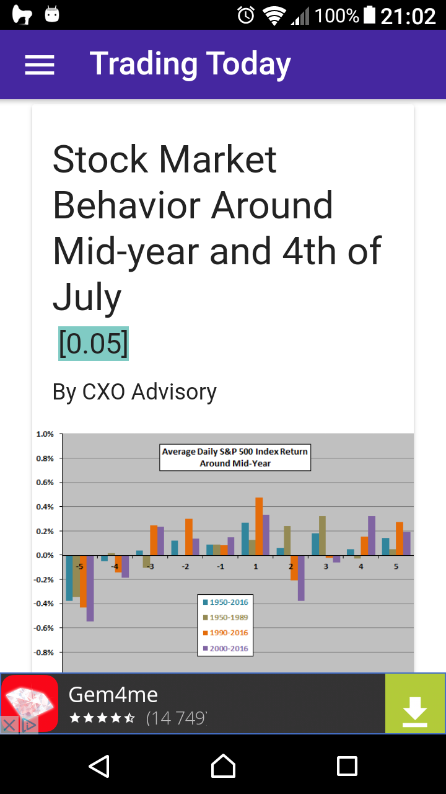

# QProb Ion

QProb Ion is hybrid mobile app for [QProb](https://qprob.com).

## Technologies

* [QProb](https://github.com/xenu256/QProb)
* [qprob_goapi](https://github.com/xenu256/qprob_goapi)
* [Ionic](https://github.com/ionic-team/ionic)

## Google Play Demo(s)

* [QProb trading news](https://play.google.com/store/apps/details?id=talaikis.qprob.qprob)
* [Technology daily](https://play.google.com/store/apps/details?id=talaikis.qprob.parameterless)
* [Business daily](https://play.google.com/store/apps/details?id=talaikis.qprob.bsnssnws)
* [Real estate daily](https://play.google.com/store/apps/details?id=talaikis.qprob.realest)
* [Insurance daily](https://play.google.com/store/apps/details?id=talaikis.qprob.webdnl)
* [Stock market daily](https://play.google.com/store/apps/details?id=talaikis.qprob.stckmrkt)
* [Entrepreneurship daily](https://play.google.com/store/apps/details?id=talaikis.qprob.entreprnrnws)

## iOS Demo(s):

...

## Maybe Todo(s)

"Maybe" means if economically viable, anyway it's just a hobby/ learning/ portfolio project. Most of it anyway are already buil-in.

* Speech commands.

"Start [read all]", "stop", "next". Simple like that. Probably needs [qprob_goapi](https://github.com/xenu256/qprob_goapi) changes (in need for an ID).

* Database caching.

With first network we write posts to db, then just update with new. Needs [qprob_goapi](https://github.com/xenu256/qprob_goapi) changes.

* Notifications

Needs users and notifications tables on API side. When new content is avaialble for user, a notification should be scheduled.
